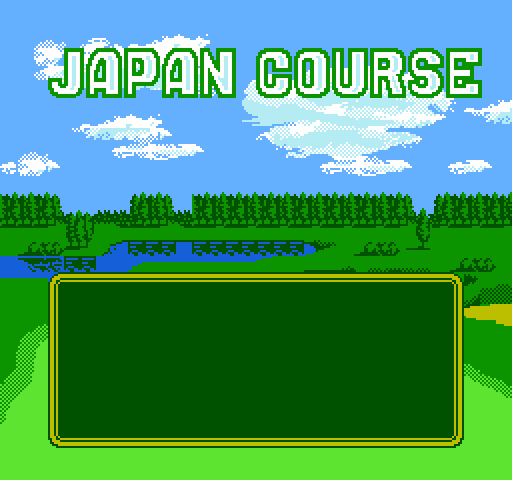

# Course Intro Scene

> **Note**: This document was written by Claude based on investigation requested by jdharms.

The full-screen landscape that appears after you pick a course — trees, a lake, clouds,
`JAPAN COURSE` / `U.S. COURSE` / `U.K. COURSE` in outlined "floating" letters, and a text
box underneath. Renders decoded straight out of the ROM are in `renders/course_intro/`.



Three separate systems meet here:

1. a **scene routine** in bank 12 that loads the graphics and runs the frame loop,
2. a **sprite-0 raster split** that swaps the background pattern table mid-screen,
3. a **byte-code text script** in bank 11 that types the dialogue.

## Reaching the scene

Bank 13 `$8000` is "start a round", entered from the menu's `$FF` terminal code.

```
$801A  LDA LoadSavedGameFlag ($04D7)
$801D  BNE $806A                 ; CONTINUE -> skip the scene entirely
$8029  LDA MaybeTwoPlayerFlag
$802C  BNE $8064                 ; 2 players -> different scene, bank 12 $AB87
$802E  LDX GolfGameMode
$8031  CPX #$05
$8033  BCC $804F                 ; stroke/tournament-stroke
$8035  ...                       ; match play: pick opponent, far call bank 9 $B322
$804F  JSR ExecuteFarCall
$8052  .db $0C, $62, $92         ; -> bank 12 $9262   <<< the scene
$8055  BIT MenuState ($068F)
$8058  BPL $8064                 ; B was pressed during the scene -> back out
```

So the scene runs on **NEW GAME, 1 player** only. `LoadSavedGameFlag` is why CONTINUE
never shows it.

### Scene setup — bank 12 `$9262`

```
$9262  LDA #$00
$9264  STA $071D                 ; portrait/palette variant index
$9267  STA $071E                 ; attribute-override flag
$926A  LDA #$40 : STA $070D      ; accepted-button mask (B only, at this point)
$926F  LDA GolfGameMode : CLC : ADC #$01
$9275  JSR DispatchInlineJumpTable ($D227)
       $01->$9291  $05->$929C  $02/$03->$92A7  $06/$07->$92B2  $08->$92DB
       (no match)  -> $928E  JMP $9478
```

Each handler stores a **script pointer** into `$06E7/$06E8` and returns; the `$928E`
fall-through then jumps into the scene proper. For plain stroke play (`GolfGameMode = 0`,
so key `$01`) the handler at `$9291` sets the script pointer to bank 11 `$A0EE`.

| Key | `GolfGameMode` | Handler | Script (bank 11) |
|---|---|---|---|
| `$01` | `$00` stroke play | `$9291` | `$A0EE` |
| `$02`/`$03` | `$01`/`$02` 18H/36H tournament (stroke) | `$92A7` | `$A33C` |
| `$05` | `$04` match play | `$929C` | `$A2D5` |
| `$06`/`$07` | `$05`/`$06` tournament match | `$92B2` | via `$92C3` table, keyed on `OpponentGolferIdentity` |
| `$08` | `$07` bet on 1 hole | `$92DB` | keyed on `OpponentGolferIdentity` |

The match-play handlers also copy `OpponentGolferIdentity ($0131)` into `$071D`, which
selects the opponent's sprite tiles and palette below.

> `$071D` is labelled `SuppressMenuHistoryPushFlag` in the `.mlb`. That is its meaning in
> the title-menu driver (`docs/menu_system.md`); this scene reuses the same byte as a
> variant index. Both readings are correct in their own context.

## Where the graphics live

`$9478` loads four compressed blobs. Each pointer is a **graphics table**, not raw data;
`LD494_DecompressGraphicsTable ($D494)` reads its header and feeds each stream to the
`$D4C3` decompressor:

```
dest_lo, dest_hi     ; starting PPU address
count                ; number of streams
ptr_lo, ptr_hi       ; x count  (stream N starts where stream N-1 stopped)
```

| What | Table | Streams | PRG offsets | PPU |
|---|---|---|---|---|
| Landscape tiles + text font | bank 6 `$A781` | `$A786` | `0x1A786-0x1B1B3` | `$1000-$1EDF` |
| Course letters, shared part | bank 8 `$9BDB` / `$A452` | `$9BE2` | `0x21BE2-0x21F0C` | `$0000-$04AF` |
| Course letters, **Japan** | bank 8 `$9BDB` | `$9F0D` | `0x21F0D-0x22451` | `$04B0-$0BCF` |
| Course letters, **US + UK** | bank 8 `$A452` | `$A459` | `0x22459-0x22944` | `$04B0-$0B2F` |
| Portrait sprite tiles (`$071D`) | bank 8, see below | | | `$0C00-$0EFF` |
| Nametable, **Japan** | bank 8 `$B723` | `$B728` | `0x23728-0x2391A` | `$2000-$23FF` |
| Nametable, **US** | bank 8 `$B91B` | `$B920` | `0x23920-0x23B03` | `$2000-$23FF` |
| Nametable, **UK** | bank 8 `$BB04` | `$BB09` | `0x23B09-0x23CEC` | `$2000-$23FF` |

The tile-graphics table is selected by `CurrCourse ($0102)` from the pointer table at
bank 12 `$96A7`; the nametable table from `$96AD`. Japan has its own letter stream; US and
UK share one and differ only in twelve nametable tiles (the `S` vs `K` of `U.S.`/`U.K.`).

Every stream ends exactly where the next begins and every decode lands on a clean
boundary (`$23FF` for a nametable, i.e. 960 tiles + 64 attribute bytes), which is what
confirms the region boundaries above.

Indexed by `$071D` (`0` for every 1-player stroke/tournament game):

| Table | Purpose | Entries |
|---|---|---|
| `$96C7` | portrait CHR (bank 8, PPU `$0C00`) | `$A945 $AB9F $B2A7 $ADED $B4DF $B035 $B035` |
| `$96D5` | portrait object definitions (bank 12) | `$990E $9920 $9956 $9932 $9968 $9944 …` |
| `$96B9` | 32-byte palette (bank 12) | `$9777 $9797 $97F7 $97B7 $9817 $97D7 $97D7` |

The seven palettes are identical in their background half; only the sprite half changes,
which is how the portraits get different clothing colours.

`GolfGameMode` also picks a 32-tile header row written to PPU `$20E0` (nametable row 7)
from `CourseIntroModeTextPtrTable` (`$96B3`): `$988B` = 18-hole, `$98AB` = 36-hole,
`$986B` = bet-on-one-hole. `GolfGameMode & 3 == 0` — plain stroke or match play — skips
that write entirely, which is why the ordinary stroke-play screen has no header line.

That row is spelled with a **second, smaller font** occupying CHR `$0000`-`$02CF`, loaded
by the shared first stream. `04 07 0B 14 0D 0A` is `18HOLE`. Its existence is what pins
the raster split below row 7.

## The mid-frame pattern-table switch

**This is the thing that makes the scene hard to breakpoint.** The course-name letters and
the landscape do not live in the same pattern table, so the scene is a sprite-0 raster
split.

`$9574`, before the loop starts, clears bits 3 and 4 of the `PPUCTRL` cache `$10`, so the
frame *starts* with background pattern table `$0000` — the floating letters. Then every
frame, in `CourseIntroFrameTick` (`$95B4`):

```
$95B8  BIT $2002 : BVS $95B8    ; wait for the sprite-0 flag to clear
$95BD  BIT $2002 : BVC $95BD    ; wait for the sprite-0 HIT
$95C2  LDY #$9C : DEY : BNE     ; burn ~780 cycles (~7 scanlines)
$95C7  LDA $10 : ORA #$10
$95CB  STA $2000                ; background pattern table -> $1000, mid-screen
```

Above the split the nametable indexes CHR `$0000` (the small font and the course-name
letters); below it, CHR `$1000` (landscape and the dialogue font). In a tile viewer you
only see the text once you have advanced past the split scanline — the same tile indices
mean different things above and below it. `$95A4` puts bit 4 back into `$10` on the way
out.

The boundary falls on **tile row 8**: nametable rows 0-7 (sky, the logo, and the mode-text
row at `$20E0`) come from CHR `$0000`, rows 8-29 from CHR `$1000`. That is consistent both
ways — the mode-text row is spelled in the CHR `$0000` font, and row 8's cloud tiles
(`$03`, `$0C`-`$2C`) only exist as clouds in CHR `$1000`.

## Frame loop

```
$957D  LDA Controller_NewPress_Tmp ($18)
       STA MenuInputByte ($0681)
       JSR $F8CA                 ; OAM / object update
       JSR $95B4                 ; the split above, then input, then $95F3
       JSR $FF7E
       LDA $0682 : BEQ $957D     ; loop until the exit flag is set
```

`$95B4` masks the new-press byte with `$070D` before acting on it: `$80` (A) sets the exit
flag `$0682`; `$40` (B) sets `MenuState = $FF` *and* the exit flag, which is what `$8055`
in bank 13 reads to back out to the menu.

`$95F3` dispatches on the scene phase `$070A`:

| `$070A` | Handler | Does |
|---|---|---|
| `0` (no match) | falls through to `$960A` | nametable write, descriptor `$9610` |
| `1` | `$960A` | same |
| `2` | `$9615` | walks 12 steps from `TextBoxOpenStepPtrTable` (`$96E3`) using `CourseIntroPhaseStep` as the counter — the text box opening outward from its centre — then `INC $070A` |
| `3` | `$9672` | `INC $070A`, then the box's left and right edges (`$98CB`, `$98DA`) |
| `4` | `$9680` | the box's top and bottom edges (`$98E9`, `$98EE`), clears `ScriptResumePtr`, sets `ScriptDelayCounter = $16` (22-frame pause) and `ScriptTextBufferPage = $70`, `INC $070A` |
| `5` | `$96A0` | `ExecuteFarCall` bank 11 `$9033` — run the text script |

The course-name letters are **not** animated by these phases; they come straight out of
the compressed nametable. Every phase-2 rect targets `$2244`-`$234B`, i.e. rows 17-26.

### Nametable descriptors

Two entry points share one descriptor format (`dest_lo, dest_hi, flags|width, height`):
`WriteNametableTiles` (`$CE84`) follows it with inline tile data, while
`WriteNametableTilesMode1` (`$CE75`) follows it with a **single byte that fills the whole
rectangle** — `$CF0C` skips the source increment when `$29` is 1. Bit 7 of the width byte
replaces the inline data with a 2-byte source pointer; bit 6 is the fill flag for the
`$CE84` entry point.

`$9615` assembles its descriptors in `NametableDescriptorBuffer` (`$0410`): four bytes
copied from the step list, then `$02` as the fill byte.

## The text script

The dialogue is a byte-code program, not a string table. Text is stored as **plain
lowercase-and-uppercase ASCII** inline in the script, which is why a search for
`TRY TO GOLF WELL` in the ROM finds nothing — it is stored as `Try to golf well`.

The stroke-play script starts at bank 11 `$A0EE` (PRG `0x2E0DE`):

```
$A0EE  F9 02              ; select text window 2
$A0F0  F2 AD 61 F8 A0     ; if [$61AD] == 0 -> $A0F8
$A0F5  F5 FD A0           ; jump $A0FD
$A0F8  F2 AE 61 77 A1     ; if [$61AE] == 0 -> $A177
$A0FD  F6 0F 07 00        ; poke $00 -> $070F
$A101  "The following are your latest 2 scores" ...
...
$A177  F4 03 60 02 80 A1  ; if [$6003] >= $02 -> $A180
$A180  F6 0F 07 00
$A184  "Try to golf well, as a" FB "lower score may give "
       "youa higher player rank." F6 0F 07 FF FC
```

`$61AD/$61AE` are the cumulative-score words in SRAM, so a save with no rounds played gets
the "Try to golf well…" line and an established save gets its last two scores, its average
and its rank instead.

### Interpreter

Bank 11 `$9033`, called once per frame from scene phase 5. `$06E7/$06E8` is the script
program counter. `$06E5` is a countdown: it starts at `$16` (a pause before the first
character) and thereafter sits at 1, so one token is consumed per frame — the typewriter
effect. Bytes below `$F0` are characters; `$F0`-`$FF` dispatch through
`DispatchInlineJumpTable` at `$906C`.

| Op | Bytes | Handler | Meaning |
|---|---|---|---|
| `$00`-`$EF` | 1 | `$90AE` | print character |
| `$F1 n` | 2 | `$9373` | start portrait animation `n` from `$947C`; sets bit 6 of `$06E5` |
| `$F2 lo hi tlo thi` | 5 | `$9343` | if `[lo/hi] == 0` jump to `t` |
| `$F3 x y` | 3 | `$9324` | set cursor (`$06EC`, `$06ED`) |
| `$F4 lo hi v tlo thi` | 6 | `$92E7` | compare `v` against `[lo/hi]`, branch |
| `$F5 lo hi` | 3 | `$9162` | jump |
| `$F6 lo hi v` | 4 | `$92C3` | store `v` to RAM `lo/hi` |
| `$F7` | | `$92A4` | (not traced) |
| `$F8 lo hi` | 3 | `$9285` | call native 6502 code (`JMP ($22)`) |
| `$F9 n` | 2 | `$924E` | select window geometry `n` from `$9648` (x, y, right, bottom) |
| `$FA` | | `$91F4` | (not traced) |
| `$FB` | 1 | `$91D0` | newline — x back to `$06EE`, y += 2 |
| `$FC` | | `$9176` | (not traced) — used as the "wait / end of page" terminator |
| `$FD` | | `$9170` | (not traced) |
| `$FE lo hi` | 3 | `$914B` | call script subroutine (return address saved in `$06FB/$06FC`) |
| `$FF` | 1 | `$913E` | return from script subroutine |

`FE FF 06` — seen at the head of several lines — calls a script fragment assembled in RAM
at `$06FF`, which is how the player's registered name gets spliced into a sentence.

Characters are remapped by an inline `(lo, hi, delta)` range table at `$90B1` (the
`LookupInlineRangeTable` idiom):

```
41 5A BF   ; 'A'-'Z'  -> $00-$19
61 7A B9   ; 'a'-'z'  -> $1A-$33
2C 3A 08   ; ','-':'  -> $34-$42   (covers '.', '/' and '0'-'9')
21 24 22   ; '!'-'$'  -> $43-$46
3F 3F 08   ; '?'      -> $47
27 27 21   ; '\''     -> $48
00
```

## Breakpoints

Working from the outside in:

| Where | Breakpoint | Catches |
|---|---|---|
| Entry decision | exec bank 13 `$804F` | the far call into the scene; `$0100`/`$04D7`/`$0101` are already set |
| Scene setup | exec bank 12 `$9478` | before any graphics load |
| Graphics load | exec `$D684` (fixed bank), watch `$22/$23` and `$27` | each of the four blobs; `$22/$23` is the graphics-table pointer, `$27` the bank |
| Decompressor | exec `$D4C3`, watch `$50/$51` (source) and `$54/$55` (PPU dest) | per stream |
| The raster split | exec bank 12 `$95CB` | the exact scanline the pattern table flips |
| Script step | exec bank 11 `$9066` | one script token; `$20/$21` points at it, `$06E7/$06E8` is the PC |
| Character print | exec bank 11 `$90AE` | each printed character, in A |
| Exit | write to `$0682` | A or B accepted |

A memory breakpoint on `$06E7` (write) is the quickest way to find which script a given
game mode runs, since every handler in the `$9275` dispatch writes it.

Every address named in this document now has a label in
`NES Open Tournament Golf (USA).sidecar.mlb`, so `golf-rom-peek` annotates the scene and
renders its tables as `.db` rather than decoding them as code.

## Editing notes

- The scene's text is uncompressed ASCII in bank 11 and can be edited in place as long as
  the byte count is preserved; `FB` is the line break and the window geometry from the
  `F9` opcode bounds it.
- The course-name letters are a bitmap: each cell in nametable rows 2-6 has its own tile,
  so changing the wording means editing both the nametable stream and the CHR stream.
  US and UK share a CHR stream and differ only in the twelve nametable tiles that spell
  `S` versus `K`.
- `renders/course_intro/gfxdec.py` is a Python reimplementation of the `$D4C3` stream
  decompressor (all four literal modes and the three VRAM-lookback modes) plus the
  `$D494` table walker; `render_scene.py` beside it rebuilds the three PNGs. They are
  scratch scripts, not part of the package.

  Two details of `$D4C3` are easy to get wrong and produce plausible-looking corruption
  rather than an obvious failure. Streams inside one table are **chained**: `$54/$55`
  carries over, so stream N starts where stream N-1 stopped, and `$52/$53` (the lookback
  base) is re-latched from it per stream. And the backwards-lookback mode `$C0` reads
  `$2007` twice before its copy loop (`$D670` and `$D673`) where the forward modes read it
  once, so it copies `mem[src-n+1 .. src]` reversed, not `mem[src-n .. src-1]`.
