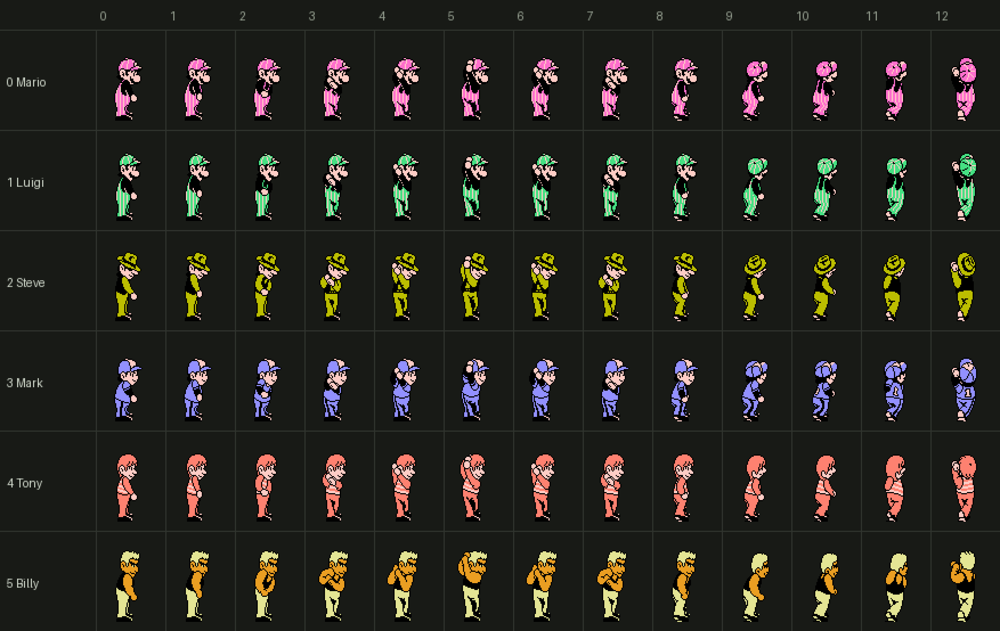
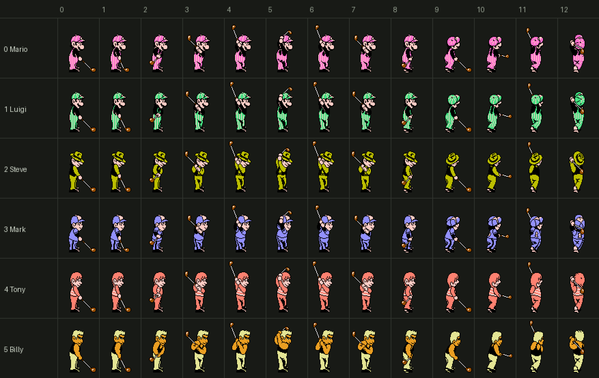

# Golfer Sprites

> **Note**: This document was written by Claude based on investigation requested by jdharms.

How the swinging golfer and his club are drawn during a shot, and how the game decides
*which* golfer to draw.

Confidence is marked per claim:

- **[C]** Confirmed - read directly out of code/data, or verified live by jdharms.
- **[D]** Derived - follows from arithmetic on table addresses/strides that closes exactly.
- **[G]** Guess - plausible reading, not verified.

## Where it happens

**[C]** The golfer is rendered by **bank 8 `$8000`**, reached once per frame from the shot
loop via `ExecuteFarCall` at bank 13 `$AAA2` (`.db $08, $00, $80`). It is the only caller.

**[C]** Two metasprites are drawn per frame:

| Sub | Renders | Sprite attribute (`$29`) |
|---|---|---|
| `$8073` | The golfer's body | `$00` |
| `$8083` | The club | `$01` |

**[C]** `$8060` picks the draw order: on animation frames `$05` and `$0B` the body is drawn
first and the club second; on every other frame the club goes first. Both append through the
shared OAM cursor `$4A`, and on the NES a **lower OAM index wins**, so whichever is written
first is in front. The effect is therefore the reverse of what the ordering reads like at a
glance: **the club is in front of the body on eleven of the thirteen frames**, and the body
comes forward only on frames `$05` and `$0B` (the top of the backswing and the end of the
follow-through). A renderer using painter's algorithm has to draw them in the opposite order
to OAM.

**[C]** `$8083` pushes `$26`/`$27` on entry (`$80A1`-`$80A6`) and restores them on exit
(`$80D4`-`$80D9`), so the club's position is expressed relative to the body's. Moving the
body moves the club with it.

## Metasprite data format

**[C]** Both go through `$FF38` (fixed bank), which reads a list at `PointerToSpriteData`
(`$45`/`$46`) and appends to OAM at `$0200 + $4A`:

```
count                  ; $00 = empty, renders nothing
per sprite, 3 bytes:
  dY    signed, added to $27  -> OAM+0  (Y)
  tile                        -> OAM+1  (tile)
  dX    signed, added to $26  -> OAM+3  (X)
```

**[C]** OAM+2 (attributes) is **not** in the data - it comes from `$29` and is therefore
identical for every sprite in one metasprite. Sign extension of `dY` goes through `$38`;
if the result carries out, that sprite is skipped (`$FF74`) rather than wrapping.

**[C]** The first body metasprite (`$81EE`) begins `13 10 11 F8 10 10 F0 ...` - a count of
`$13` = **19 sprites**, then 19 triplets. That matches jdharms' recollection of ~20 sprites
for the golfer.

## Choosing the body metasprite

**[C]** Two inputs combine into a flat index:

```
$803C  LDX $0132                  ; which golfer
$803F  TYA / CLC / ADC $80DB,X    ; Y = animation frame + per-golfer base
$8045  LDX $810A,Y                ; pointer low
$8048  LDA $8158,Y                ; pointer high
```

`$CF` is the animation frame, found at `$802E`-`$8039` by scanning `$D1` (the swing
animation timer) against a threshold table. **[C]** Despite its `SwingPowerBarPos` label in
the `.mlb`, `$CF` is the golfer animation frame index - it is *written* here by the
renderer and *read* by the swing state machine in bank 13. See `docs/practice_swing.md`.

### Body tables (bank 8)

| Table | Size | Contents |
|---|---|---|
| `$80DB` | 6 | Per-golfer base offset, non-putter (stride `$0D` = 13) |
| `$80E1` | 6 | Per-golfer base offset, putter (stride `$06`) |
| `$80E7` | 13 | Frame thresholds vs `$D1`, non-putter |
| `$80F4` | 6 | Frame thresholds vs `$D1`, putter |
| `$810A` / `$8158` | 78 each | Metasprite pointer lo/hi, non-putter (6 x 13) |
| `$81A6` / `$81CA` | 36 each | Metasprite pointer lo/hi, putter (6 x 6) |
| `$81EE` | 5,033 | Metasprite data, six contiguous per-golfer blocks (below) |

**[D]** The body metasprite data is one unbroken run from `$81EE` to `$9596`, with no padding
between golfers and none before `GolferClubBaseTable` at `$9597`:

| Golfer | Range | Metasprites | Bytes |
|---|---|---|---|
| 0 Mario | `$81EE-$851C` | 14 | 815 |
| 1 Luigi | `$851D-$8881` | 14 | 869 |
| 2 Steve | `$8882-$8BEB` | 13 | 874 |
| 3 Mark | `$8BEC-$8EE9` | 13 | 766 |
| 4 Tony | `$8EEA-$9244` | 13 | 859 |
| 5 Billy | `$9245-$9596` | 13 | 850 |

Mario and Luigi have 14 rather than 13 because their putt animation has four distinct poses
instead of three. Replacing a golfer in place means fitting inside that golfer's block or
relocating it and repointing its 19 entries in the four pointer tables.

**[D]** The four pointer tables are contiguous with no padding: `$810A` + 78 = `$8158`,
+ 78 = `$81A6`, + 36 = `$81CA`, + 36 = `$81EE` - and `$810A[0]`/`$8158[0]` is `$81EE`, so
the tables run straight into the data they point at. This closes the 6-golfer x 13-frame /
6-frame layout exactly.

## Choosing the club metasprite

**[C]** Three inputs, not two:

```
$8085  LDA $959D,Y   ; Y = ClubSelection    -> club-group base
$8089  ADC $CF                              ; + animation frame
$808E  ADC $9597,X   ; X = $0132            -> golfer base
$8093  LDA $95AD,Y -> $45 ;  $9621,Y -> $46
```

### Club tables (bank 8)

| Table | Size | Contents |
|---|---|---|
| `$9597` | 6 | Per-golfer base: `00 3A 3A 00 3A 3A` |
| `$959D` | 16 | Per-club base: `00 00 00 00 0D 0D 0D 0D 1A 1A 1A 1A 27 27 27 34` |
| `$95AD` / `$9621` | 116 each | Club metasprite pointer lo/hi |
| `$9695` | 16 | Club position-offset base, per club: `00` x4, `0B` x11, `FF` |
| `$96A5` | 6 | Club position-offset base, per golfer: `FF 00 16 FF 2C FF` |
| `$96AB` | 13 | Club position-offset base, per frame: `00 01 02 03 04 05 04 03 06 07 08 09 0A` |
| `$96B8` / `$96FA` | 66 each | Club dX / dY nudges, indexed by the sum of the three above |
| `$973C` | 906 | Club metasprite data, `$973C-$9AC5` - 93 distinct metasprites shared by the 116 pointer slots, 2-5 sprites each |

**[D]** These are contiguous too: `$9597` +6 = `$959D`, +16 = `$95AD`, +116 = `$9621`,
+116 = `$9695`, +16 = `$96A5`, +6 = `$96AB`, +13 = `$96B8`.

**[D]** The club animation is heavily shared. `$959D` collapses 16 clubs into 5 groups
(`{0-3} {4-7} {8-11} {12-14} {15}`) with stride 13, and the putter's base is `$34`; `$34`
+ 6 putter frames = `$3A`, which is exactly the per-golfer stride in `$9597`. And `$9597`
has only **two** distinct values (`$00` and `$3A`), so six golfers share just two club
animation sets: golfers 0 and 3 use one, golfers 1, 2, 4 and 5 use the other. 2 x 58 = 116,
matching the pointer table size exactly.

**[C]** The per-frame index table `$96AB` reads `00 01 02 03 04 05 04 03 ...` - frames 6
and 7 reuse the entries for frames 4 and 3. **[G]** That is presumably the backswing being
replayed in reverse on the way down, consistent with `$ABE7` mirroring the animation timer
around `$31`.

**[C]** The club offset is skipped entirely (`BMI` at `$80AC` / `$80B4`) when either
`$9695[club]` or `$96A5[golfer]` is negative. That means the putter (club 15, `$FF`) never
gets a nudge, and neither do golfers 0, 3 and 5 (`$FF` in `$96A5`).

**Resolved:** back-to-back, 66 entries each, every slot reachable. See "The nudge tables
close exactly" below.

## Position on screen

**[C]**

```
$804F  LDY ClubSelection ($CD)
$8051  LDA $80FA,Y
$8054  STA $26          ; X
$8056  LDA #$A6
$8058  ADC $05BC        ; scroll; carry out -> skip drawing entirely
$805E  STA $27          ; Y
```

`$80FA` is 16 bytes: `7C 7C 7C 7C 80 80 80 80 83 83 83 83 85 85 85 8B`. **[C]** The
golfer's X therefore varies with the club - he stands further from the ball with the long
clubs and closest with the putter (`$8B`). **[G]** The four-club grouping matches `$959D`'s
grouping, so this is presumably the same club-class split (woods / long irons / short irons
/ wedges / putter).

## Which golfer: `$0132`

**[C]** (verified live by jdharms) `$0132` selects the character, and changing it before
the "ready to swing" state changes who is drawn:

| `$0132` | Golfer |
|---|---|
| 0 | Mario |
| 1 | Luigi |
| 2 | Steve |
| 3 | Mark |
| 4 | Tony |
| 5 | Billy |

**[C]** The four opponent names come from the manual, and the ordering is confirmed in the
ROM: the opponent-select script at bank 11 `$A2E0` lists `LUIGI STEVE MARK TONY BILLY` on
consecutive rows (`F3 0E $16` through `F3 0E $1A`), i.e. golfers 1 through 5 in order.

### How it gets set

**[C]** Written in two places. The gameplay one is bank 13 `$8237`, reached from `$8220`:

```
$8220  LDX CurrentPlayerIndex ($99)
       LDA MaybePlayerHoleStatus ($0111),X
       CMP #$03 / BEQ -> $8392
$822C  TXA
       BEQ $8237        ; player 0 -> X still 0 -> Mario
       LDX $0131        ; otherwise take the opponent id
       CPX #$06 / BNE $8237
       DEX              ; clamp 6 -> 5
$8237  STX $0132
```

**[C]** This runs per shot, which explains jdharms' observation that a manual change to
`$0132` is reverted on the next shot in a one-player game: `CurrentPlayerIndex` is always
0 there, so the `BEQ` path forces `$0132` back to 0 (Mario) every time.

**[C]** `$0131` is the *opponent* slot - the identity used for anyone who is not player 0:

| Site | Effect |
|---|---|
| bank 13 `$806A` | Two-player game (`MaybeTwoPlayerFlag` `$0101` nonzero) -> `$0131 = 1`, i.e. Luigi as player 2 |
| bank 13 `$8035` | If X == 7: `$0131 = $6003 + 2`; otherwise `$0131 = 1` |
| bank 13 `$857F` | `LDA $0131 / CMP #$06 / BCS skip / INC $0131` - advance to the next opponent, capped at 6 |
| bank 11 `$9FC1`/`$9FC7` | Cutscene path: `$0131 = $06F3`, `$0132 = $06F4`, then `INC $0131` |
| bank 9 `$AF49` | Not investigated |

**[D]** The `+ 2` at `$8035` lines up with the confirmed mapping: opponent ids start at 2,
so `$6003` is a 0-based progression counter through the four computer opponents. The `INC`
at `$857F` walks it forward, and the `6 -> 5` clamp at `$8236` means the fourth opponent is
also the last.

**[G]** `$6003` is labelled `SramMagic` in the `.mlb`. Given it feeds an opponent index
via `+2`, that label looks wrong - it reads more like a tournament progression or rank
counter. Worth re-checking before relying on the existing name.

## Notes for anyone scanning bank 8 for free space

**[C]** A naive "runs of identical bytes" scan of bank 8 reports candidate free regions at
`$9621` (26 x `$97`), `$963B` (34 x `$98`), `$965D` (29 x `$99`) and `$967D` (24 x `$9A`).
These are **not** free - they are stretches of the `$9621` club-pointer *high-byte* table,
where consecutive metasprites happen to live in the same page.

## Per-golfer CHR — resolved

**[C]** The six golfers have **entirely separate sprite CHR**, swapped on load. They are not
palette swaps of one tile set: every golfer's metasprites index the same range (`$00`
upward), so only one golfer's tiles can be resident at a time.

**[C]** Bank 5 `$BDFA` picks the blob:

```
$BDFA  LDX GolferIdentity ($0132)
$BDFD  LDA GolferShirtColourTable,X : STA $0487
$BE03  LDA GolferBodyTypeTable,X : PHA
$BE07  TXA
$BE08  JSR LD267                  ; inline (key, lo, hi) table
       $00->$BEEC  $01->$BEF3  $02->$BEFA  $03->$BF01  $04->$BF08  $05->$BF0F
```

Each target is a three-instruction stub: `JSR LoadCompressedGraphics`, inline bank+address,
`RTS`.

| `$0132` | Golfer | Stub | CHR table | PPU range | Tiles used | Compressed |
|---|---|---|---|---|---|---|
| 0 | Mario | `$BEEC` | bank 1 `$A1E0` | `$0000-$096F` | 151 (max `$96`) | 1,985 B |
| 1 | Luigi | `$BEF3` | bank 0 `$A238` | `$0000-$0A5F` | 166 (max `$A5`) | 2,124 B |
| 2 | Steve | `$BEFA` | bank 1 `$A9A6` | `$0000-$0A5F` | 166 (max `$A5`) | 2,100 B |
| 3 | Mark | `$BF01` | bank 1 `$B1DF` | `$0000-$093F` | 148 (max `$93`) | 2,077 B |
| 4 | Tony | `$BF08` | bank 0 `$AA89` | `$0000-$0A3F` | 164 (max `$A3`) | 2,132 B |
| 5 | Billy | `$BF0F` | bank 2 `$A54E` | `$0000-$0ABF` | 172 (max `$AB`) | 2,032 B |

**[D]** Each blob's decompressed end address is exactly one tile past that golfer's highest
referenced tile index, in all six cases. Two independent derivations — the metasprite tables
in bank 8 and the graphics tables in banks 0-2 — agree, which is what fixes the mapping.

## Sprite palette

**[C]** `$BDDC JSR LD41A` with inline `A0 BE 86 04 10 00` copies the 16 bytes at bank 5
`$BEA0` to `$0486`, the sprite half of the palette buffer:

| Sprite palette | Bytes | Used by |
|---|---|---|
| 0 | `0F 25 0F 36` | golfer body (`$29 = $00`) |
| 1 | `0F 17 0F 30` | club (`$29 = $01`) |
| 2 | `0F 16 0A 30` | |
| 3 | `0F 2A 21 30` | |

**[C]** `$BE00` then overwrites colour 1 of palette 0 from `GolferShirtColourTable`
(`$BF1B`): `25 2B 28 22 26 38`. Billy's stub additionally sets colour 3 to `$27`
(`$BF0F`).

So **each golfer gets exactly one custom colour** as shipped. Colour 2 (`$0F` black) and
colour 3 (`$36`, the skin tone) are shared by all six, and only Billy escapes the second.

### Write order, and what Billy actually does

**[C]** The three writes happen in this order, which is why the later ones stick:

1. `$BDDC` bulk-copies 16 bytes from `$BEA0` into `$0486`
2. `$BE00` overwrites `$0487` from `GolferShirtColourTable`
3. the per-golfer stub runs, and may overwrite anything

**[C]** Billy's stub is the only one that uses step 3, and it does nothing clever — it is
the ordinary seven-byte stub with two instructions in front:

```
$BF0F  A9 27        LDA #$27
$BF11  8D 89 04     STA $0489      <- the only difference from the other five
$BF14  20 5F D4     JSR LoadCompressedGraphics
$BF17  02 4E A5     .db $02, $4E, $A5
$BF1A  60           RTS
```

**[D]** Any stub could do the same to any of the 32 palette bytes. Generalising it is a
table widening, not a mechanism: make `GolferShirtColourTable` 6 x 3 and copy three bytes at
`$BDFD` instead of one, and every golfer gets independent control of all three usable
colours with no per-stub special-casing.

### Three colours is a hardware ceiling

**[C]** Two independent reasons, both about the PPU rather than this ROM:

- Colour 0 of a sprite palette is **transparent in every sprite**, so `$0486` is never
  displayed. (It is also uploaded to `$3F10`, which the PPU mirrors onto `$3F00`, so writing
  it disturbs the universal backdrop instead of giving you a fourth colour.)
- `RenderMetaspriteWithAttr` (`$FF38`) writes `SpriteAttrOrTransferMode` (`$29`) into OAM+2
  for **every** sprite in a metasprite (`$FF60`-`$FF62`). One metasprite, one palette.

**[D]** To exceed three colours the body has to be split across two metasprites drawn with
different `$29` — e.g. a second `RenderGolferBody` call with `$29 = $02` and a second
pointer-table set, for six colours, leaving `$FF38` untouched. The more flexible option is a
golfer-specific renderer with four bytes per sprite carrying a per-sprite attribute; that
should be a new routine rather than a change to `$FF38`.

### `$29` is dual-purpose - do not census it by byte pattern

**[C]** `$29` is the OAM attribute byte for `$FF38` **and** the transfer mode for the
`$CE84` nametable family (`$CE88` writes the mode there; `$CE62` and `$CE68` are further
entries that set modes 0 and 2). A search for `LDA #imm : STA $29` therefore returns a
mixture of sprite palettes and nametable modes, and reading the result as palette usage is
wrong. An earlier revision of this document did exactly that and concluded sprite palette 2
was unused; `$CE68` is a nametable entry point and says nothing about sprite palettes.

**[C]** The reliable enumeration is the other direction — there are only **four**
`JSR $FF38` sites in the whole ROM:

| Site | Draws | `$29` |
|---|---|---|
| bank 8 `$807F` | golfer body | `$00` |
| bank 8 `$80D1` | club | `$01` |
| bank 13 `$9E09` | | `$00` |
| bank 13 `$A776` | | `$01` |

**[C]** Everything else that puts sprites on screen goes through the object engine instead,
which loads each object's own attribute byte from `$78F1,X` into `$29` at
`LoadObjectSpriteAttr` (`$FD54`) and uses a different pointer (`$20`/`$21`, not `$45`/`$46`).

**Open:** which sprite palettes are live during a shot. Answering it means enumerating the
attribute bytes of the objects allocated on the shot screen, or a breakpoint on OAM writes —
not a byte search. What *is* established is that colours 1 and 3 of palette 0 are safe to
repoint, because the shipped game already changes colour 1 for every golfer and colour 3
whenever Billy plays.

## Sprite layout

**[C]** The body is effectively drawn on an **8x8 grid**. Across all six golfers and all 19
frames, `dY` is always a multiple of 8 and takes one of eight values (`-40` to `+16`); `dX`
is a multiple of 8 in every case but two.

| | Values | Span |
|---|---|---|
| `dY` | `-40 -32 -24 -16 -8 0 +8 +16` | 8 rows, `-40` to `+23` |
| `dX` | `-24 -16 -8 0 +8` | 5 columns, `-24` to `+15` |

**[C]** The two exceptions are `(-40, -15)` and `(-40, -7)` — the top row of the tall build's
hat, nudged one pixel left.

**[D]** So the body occupies a **40 x 64 pixel box on a 5 x 8 grid of 8x8 cells**, of which
18-25 are filled per frame. The origin sits at column 3, row 5 of that grid, and because the
lowest row is `dY +16`, the box's bottom edge is exactly the `dY +24` foot line all six
golfers share.

**[C]** The club is the opposite: 157 of its 159 distinct offsets are *not* multiples of 8.
It spans `dY -53..+23` and `dX -29..+17` and is positioned freely to the pixel, which a thin
diagonal shaft needs. Body and club together fit in roughly 64 x 88 pixels.

**[C]** Peak sprites on a single scanline, body and club together, across every golfer, club
and frame: **6**. The hardware limit is 8, so a replacement character has about two sprites
of headroom per scanline before it starts dropping.

## Frame inventory

| Golfer | Swing frames | Unique | Putt frames | Unique | Sprites/frame | Peak per scanline | Metasprite bytes |
|---|---|---|---|---|---|---|---|
| 0 Mario | 13 | 11 | 6 | 4 | 18-21 | 4 | 815 |
| 1 Luigi | 13 | 11 | 6 | 4 | 19-23 | 4 | 869 |
| 2 Steve | 13 | 11 | 6 | 3 | 20-25 | 4 | 874 |
| 3 Mark | 13 | 11 | 6 | 3 | 18-21 | 4 | 766 |
| 4 Tony | 13 | 11 | 6 | 3 | 20-25 | 4 | 859 |
| 5 Billy | 13 | 11 | 6 | 3 | 20-23 | 4 | 850 |

**[C]** The 13 swing entries hold only **11 distinct poses**: frame 6 reuses frame 4's
pointer and frame 7 reuses frame 3's, so the top of the backswing is replayed on the way
down. This is the body counterpart of the `$96AB` reversal already noted for the club.

**[C]** The putt animation is shorter still — frames 1 and 3 share a pointer, frames 0 and 4
share one, and for Steve, Mark, Tony and Billy frames 1, 2 and 3 are all the same pointer.
Putt frame 0 also reuses the golfer's *swing* frame 1 metasprite, so the address pose is
drawn from one definition in both animations.

**[D]** All 80 distinct body metasprites across all six golfers occupy `$81EE-$9554` in
bank 8, 5,033 bytes in total.

**[C]** No frame ever puts more than **4 sprites on one scanline**, half the hardware limit
of 8 — leaving headroom for the club, the ball and the HUD on the same lines.

## Redrawing a golfer

`golf-golfer-export <rom> <out_dir>` writes one layered Aseprite file per golfer per
animation, plus a JSON sidecar. Layers, bottom to top:

| Layer | Flags | Purpose |
|---|---|---|
| `body - draw here` | editable | the golfer; the only layer meant to be repainted |
| `clubs 0-3 - move only (nudge class 0)` | editable | one layer per club animation group |
| `clubs 4-7 - move only (nudge class 11)` | editable, hidden | |
| `clubs 8-11 - move only (nudge class 11)` | editable, hidden | |
| `clubs 12-14 - move only (nudge class 11)` | editable, hidden | |
| `guides - locked` | movement locked | 8x8 cell grid, the body box, origin, foot line |

**[C]** A swing needs **four** club layers, not one. `GolferClubGroupBaseTable`
(`$959D`) splits the 16 clubs into five animation groups - `0-3`, `4-7`, `8-11`, `12-14`
and the putter - each with its own metasprites and its own CHR blob, and the golfer stands
at a different X for each (`$7C $80 $83 $85 $8B`). The body art is the same for all of
them; only the origin moves, which is why one body layer serves every club.

**[C]** `ClubNudgeClubBaseTable` (`$9695`) uses a *coarser* split: clubs `0-3` are nudge
class 0 and clubs `4-14` are all nudge class 11. So the last three club layers **cannot be
positioned independently** - moving one has to move all three. The sidecar's
`nudge_classes_shared_by` names the layers that share a class so an importer can enforce
it. Only the first club layer is visible on open; toggle the others to check the fit.

**[D]** The canvas is 64 x 88 with the drawing origin at (32, 56), sized to fit every golfer,
both animations and the club's full travel including its nudge. The Aseprite grid is set to
8x8 aligned to that origin.

### Palette

**[D]** The file carries **every NES colour worth offering**, not just the three the golfer
uses: index 0 is transparent, then 55 colour entries, then four guide colours - 60 in all.

Ten of the console's 64 entries render as solid black, so the nine spares are folded onto
`$0F`, the one the game itself uses. `$0D` goes with them, which is a bonus: it sits *below*
black and some CRTs and most capture hardware object to it, and an artist can no longer
reach it by accident. `canonical_nes()` in `golf/core/palettes.py` does the folding, so an
importer reading `$2E` off a modified ROM resolves it to the same slot.

That makes the index-to-colour relationship non-arithmetic, so the sidecar carries
`palette.nes_by_index` as the authoritative map - `null` marks transparent and the guides.
Every entry is named, so hovering a swatch in Aseprite shows its NES value, with the
golfer's own colours marked (`$25 - body 1`) and the black labelled `$0F - black`.

One duplicate survives on purpose: `$20` and `$30` are both white in this palette rendering,
but they are genuinely distinct entries and `$30` is the one the club uses.

The three-colour limit is therefore **not enforced while drawing** - an artist can reach for
any NES colour. It is the importer's job to read the body layer, collect the distinct
indices, and reject anything using more than three. The sidecar's `palette` block records
the base index and the golfer's current three so a check has something to compare against.

Three things the export encodes rather than documents:

- **Linked cels.** Frames that share a metasprite pointer in the ROM - swing frames 6 and 7
  reuse 4 and 3 - are written as Aseprite linked cels, so editing one edits both, exactly as
  the game behaves.
- **The club is movable, not locked.** Each club layer's cel position is the canonical one;
  the sidecar records it per frame along with the nudge slot that frame writes to, so an
  importer can turn a moved cel into `ClubNudgeXTable`/`ClubNudgeYTable` entries. Frames
  sharing a slot (6 with 4, 7 with 3) are flagged, as are layers sharing a nudge class.
  Both axes are in normal use - 33 of the 66 shipped slots move horizontally and 36
  vertically - so nothing should constrain dragging to one axis.
- **Priority.** Aseprite's layer order is fixed for a whole file, but the game puts the body
  in front on frames `$05` and `$0B` only. Those two frames get a dashed bar across the top
  of the guides layer, and are listed in the sidecar as `body_in_front_frames`.

A linked cel carries its own position in the file even though it shares an image, so the
export repeats the source cel's x/y on every link. Leaving them at zero drops those frames
in the canvas corner.

Giving every golfer a nudge, rather than only Luigi, Steve and Tony, is a data change with
no code change: rewrite `ClubNudgeGolferBaseTable` as `00 16 2C 42 58 6E` and grow both
nudge tables from 66 to 132 entries. The `BMI` skips at `$80AC`/`$80B4` simply stop firing.

## Renders

`renders/golfers/render_golfers.py` decodes the CHR, the metasprite tables and the palette
straight out of the ROM and writes two contact sheets:

- `renders/golfers/swing_frames.png` — 6 golfers x 13 swing frames
- `renders/golfers/putt_frames.png` — 6 golfers x 6 putt frames



Body only. The club is a separate metasprite drawn from its own tables (see above) and only
**two** club animation sets exist across all six golfers.

## Where each sprite is drawn

**[C]** Position is stored in three layers, and only the middle one varies per golfer.

**1. The origin is golfer-independent.** `$804F` sets it from the club and the scroll alone:

```
$804F  LDY ClubSelection ($CD)
$8051  LDA GolferScreenXTable,Y : STA $26     ; 7C 7C 7C 7C 80 80 80 80 83 83 83 83 85 85 85 8B
$8056  LDA #$A6 : CLC : ADC $05BC : STA $27   ; carry out -> skip drawing
```

No index by `$0132` anywhere. Every golfer is drawn from the same point.

**2. Height lives in the metasprite's own signed offsets.** Each triplet is `(dY, tile, dX)`
relative to that origin, so a taller golfer is simply one whose `dY` values reach further
up:

| Golfer | `dY` span (address pose) | Height | Width |
|---|---|---|---|
| 0 Mario | `-32 .. +24` | 56 px | 32 px |
| 1 Luigi | `-40 .. +24` | 64 px | 24 px |
| 2 Steve | `-40 .. +24` | 64 px | 24 px |
| 3 Mark | `-32 .. +24` | 56 px | 32 px |
| 4 Tony | `-40 .. +24` | 64 px | 24 px |
| 5 Billy | `-40 .. +24` | 64 px | 24 px |

**[D]** All six share the same bottom edge, `dY +24`. **The origin is the golfer's feet, not
his centre**, which is exactly what lets one club-indexed origin serve six different heights.
Mario and Mark are a short, wide build; Luigi, Steve, Tony and Billy are tall and narrow.

**3. The club gets its own animation set per build, plus a fine nudge.** `$8083` pushes
`$26`/`$27`, adjusts them, draws, and restores — so the club is positioned relative to the
body.

```
$80A7  LDX ClubSelection    : LDA ClubNudgeClubBaseTable,X  : BMI skip
$80AE  LDX GolferIdentity   : LDY ClubNudgeGolferBaseTable,X : BMI skip
$80B7  ADC ClubNudgeGolferBaseTable,X
$80BA  LDX SwingPowerBarPos : ADC ClubNudgeFrameBaseTable,X : TAX
$80C1  $26 += ClubNudgeXTable,X
$80C9  $27 += ClubNudgeYTable,X
```

### The nudge tables close exactly

**[C]** *(supersedes the "Open" note in the previous revision, which contained an arithmetic
slip — `$2C + $0B + $0A` is `$41` = 65, not `$47`.)*

Enumerating every reachable `(club, golfer, frame)` combination gives **66 distinct indices,
0 through 65, with no unused slots**. `$96FA - $96B8` is 66 bytes, so `ClubNudgeXTable` is
`$96B8-$96F9` and `ClubNudgeYTable` is `$96FA-$973B`, both exactly full. The layout is
**3 golfers x 2 club classes x 11 frames**:

- `ClubNudgeClubBaseTable` contributes `$00` (clubs 0-3) or `$0B` (clubs 4-14); `$FF` for the putter
- `ClubNudgeGolferBaseTable` contributes `$00`, `$16`, `$2C` for Luigi, Steve and Tony; `$FF` for Mario, Mark and Billy
- `ClubNudgeFrameBaseTable` contributes `$00`-`$0A`

**[C]** The corrections are small — `-3..+5` in X and `-2..+4` in Y — a fit-up, not a
reposition.

### Why Mario, Mark and Billy need no nudge

**[D]** `GolferClubBaseTable` (`$9597` = `00 3A 3A 00 3A 3A`) and `GolferBodyTypeTable`
(bank 5 `$BF21` = `00 01 01 00 01 01`) both split `{0,3}` from `{1,2,4,5}`, and that split is
now identified: **it is body height.** Mario and Mark are the 56 px build and get their own
58-frame club set drawn to match; the other four share the 64 px set. Billy uses that set
unmodified, so only Luigi, Steve and Tony need per-golfer correction on top of it.

### Club CHR

**[C]** The club has its own tiles, `$A8-$C7`, loaded separately from the body. Bank 5
`$BE1E` onward classifies `ClubSelection` into the same five groups as `$959D`
(`< 4`, `< 8`, `< $0C`, `< $0F`, `= $0F`), then `PLA`s the body-type byte pushed at `$BE06`
and picks one of **ten** graphics tables in bank 4, `ClubSpriteChrTables` (`$A8AB-$A8DC`,
five bytes each):

| Body type | Golfers | Tables | PPU |
|---|---|---|---|
| 0 (56 px) | Mario, Mark | `$A8AB $A8B0 $A8B5 $A8BA $A8BF` | `$0A80` |
| 1 (64 px) | Luigi, Steve, Tony, Billy | `$A8C4 $A8C9 $A8CE $A8D3 $A8D8` | `$0AC0` |

**[D]** The two destinations are what keep body and club from colliding in the sprite pattern
table. The short build's body ends at `$096F`/`$093F` and its club starts at `$0A80`; the
tall build's bodies end at `$0A3F`-`$0ABF` and the club starts at `$0AC0`. Billy's body
runs to `$0ABF` — **one byte** below the club. That is the tightest fit in the whole sprite
system and the practical ceiling on a replacement character for that slot.



`renders/golfers/render_golfers.py` also writes `swing_with_club.png`, which composites body
and club through the full chain above; the club tracks every golfer's hands across all 13
frames, which is what confirms the indexing.

## Open questions

- ~~Extent of `$96B8`/`$96FA`.~~ **Resolved** - 66 entries each, fully used.
- ~~What distinguishes the two club animation sets in `$9597`.~~ **Resolved** - body height,
  56 px versus 64 px.
- ~~Why golfers 0, 3 and 5 need no club position nudge while 1, 2 and 4 do.~~ **Resolved** -
  Mario and Mark are the short build with their own club set; Billy uses the tall set unmodified.
- bank 9 `$AF49`, the third writer of `$0131`.
- ~~Whether the six golfers have distinct CHR, or share tiles with palette swaps.~~
  **Resolved** — separate CHR per golfer, plus one palette entry. See above.
