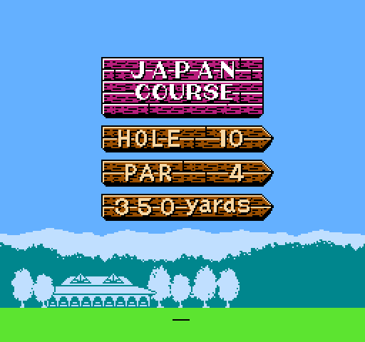
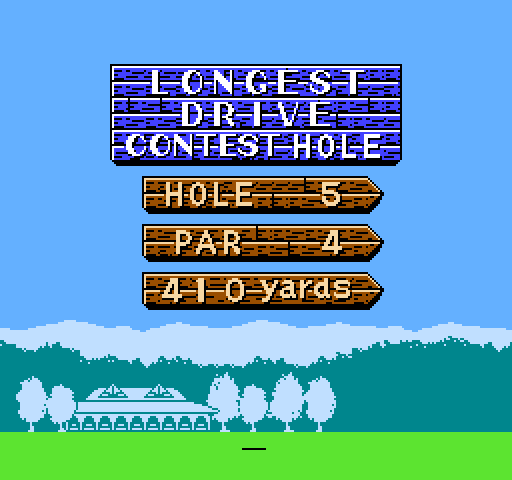
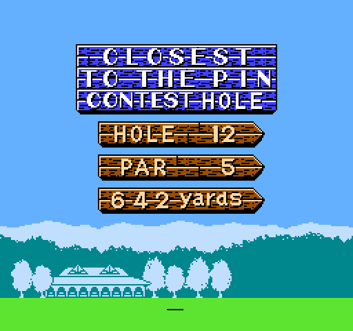
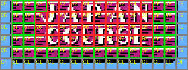

# The Pre-Hole Signpost

> **Note**: This document was written by Claude based on investigation requested by jdharms.






Renders rebuilt straight from the ROM are in `renders/prehole_signpost/`
(`render_signpost.py` replays `LC_AC2F_DrawSignpostCard`'s decompression and nametable
writes exactly).

**The wording is not built from arbitrary text tiles - every banner is a pre-drawn
picture.** `JAPAN COURSE`/`US COURSE`/`UK COURSE`, `HOLE`, `PAR`, `yards`, and both
contest titles (`LONGEST DRIVE CONTEST HOLE`, `CLOSEST TO THE PIN CONTEST HOLE`) are
each one fixed graphic blob picked whole out of 5 options (see "Banner selection"
below) - there is no font-plus-string mechanism for them, unlike the scorecard's title
row. **The only genuinely generic part of the card is the numbers** - hole number, par,
and yardage go through the reusable 2x2-tile big-digit renderer
(`LC_AD0D_BufferBigDigit`/`LC_AD31_FlushBigDigitBuffer`) described below, which really
is a "write any digit at any position" primitive. Swapping in new wording (a new course
name, a different label than "PAR") means drawing a new picture and pointing the
banner-table entry at it, not editing a string.

The full-screen card shown before every hole ("HOLE n PAR p ddd YARDS" on a signpost
graphic), reached between the tee-off setup and actual play. It's built from two
far-called entry points in bank 12, both reached from bank 13's hole-setup code:

| Entry | Far-called from | Does |
|---|---|---|
| **`InitPreHoleSignpostScene`, bank 12 `$AB87`** | bank 13 `$8064` | starts music track `$10`, places the golfer standee object, does **not** draw the card |
| **`DrawPreHoleSignpost`, bank 12 `$ABA5`** | bank 13 `$81AB`, right before `StartCourseBgm` and the per-player turn loop | draws the signpost card via `LC_AC2F_DrawSignpostCard`, then waits for A/B |

Both entries fall into the same tail (`LC_ABB8` onward): turn rendering back on, run
`LC_8158` (a fixed 5-iteration warm-up loop), then loop on `WaitForVblank` ->
`$F8CA` (per-frame object/OAM update) -> `LC_AD74` (exit-flag check) -> `$FF7E` until
`SceneExitFlag` (`$0682`) is set. `LC_AD74` sets it when `MenuInputByte` has bit `$80`
(A) or `$40` (B) set - so the card just sits there until the player presses a button.

This is the same generic "modal scene" plumbing `docs/course_intro_scene.md` describes
for the course-intro screen: `$0681` `MenuInputByte`, `$0682` `SceneExitFlag`, `$0684`
`MaybeScenePhase`, and the OAM/object-update call through `$F8CA` are shared machinery,
not something built specifically for the signpost.

## `LC_AC2F_DrawSignpostCard`

```
LC_AC2F_DrawSignpostCard:
$AC2F  JSR LoadCompressedGraphics
       .db $05, $9F, $A6         ; bank 5 $A69F -> signpost CHR (font + wood texture)
$AC35  JSR LoadCompressedGraphics
       .db $05, $DD, $A6         ; bank 5 $A6DD -> more signpost CHR
$AC3B  JSR LoadCompressedGraphics
       .db $05, $B3, $B3         ; bank 5 $B3B3 -> more signpost CHR
$AC41  JSR Load32BytesToBuffer
       .dw $ADC4                 ; JapanSignpostData - the signpost palette + banner blobs
$AC46  LDA HoleMatchStatus ($0103)
       ...                       ; long-drive/nearest-pin contest holes get PaletteBuffer[$047D] = $12
$AC50  LDA #$04 : JSR AllocateObjectRecords[$F7C0]
       .dw $B070                 ; 4 decorative objects (see below)
$AC57  ...                       ; PPUCTRL |= $20 (sprite pattern table select)
$AC5D-$AC7F                      ; picks and writes the course-name/contest banner (see below)
$AC84-$ACAF                      ; hole number, 1 or 2 digits (subtracts 10 for 10-18)
$ACAF-$ACC7                      ; par, 1 digit
$ACC7-$ACF1                      ; distance, 3 BCD digits
$ACF1-$AD0C                      ; HoleMatchStatus != 0: silence music, queue MusicRequest $11/$12
```

### Banner selection

`$AD86` is a table of five 6-byte `WriteNametableTiles` descriptors (dest, header,
rows, then a pointer since header's bit 7 is set):

| Index | Selected when | Dest | Size | Pointer | Text |
|---|---|---|---|---|---|
| 0 | `CurrCourse`=0 (Japan) | `$20A8` | 16x6 | `$ADE4` | `JAPAN COURSE` |
| 1 | `CurrCourse`=1 (US) | `$20A8` | 16x6 | `$AE44` | `US COURSE` |
| 2 | `CurrCourse`=2 (UK) | `$20A8` | 16x6 | `$AEA4` | `UK COURSE` |
| 3 | `HoleMatchStatus`=1 (long drive) | `$2086` | 20x7 | `$AF04` | `LONGEST DRIVE CONTEST HOLE` |
| 4 | `HoleMatchStatus`=2 (nearest to pin) | `$2086` | 20x7 | `$AF90` | `CLOSEST TO THE PIN CONTEST HOLE` |

The selection logic (`$AC5D`-`$AC69`) reads more subtly than it looks: `LDX CurrCourse`
loads the course into X, but then `LDA HoleMatchStatus`/`ADC #$02`/`TAX` **overwrites X
with `HoleMatchStatus + 2`, discarding `CurrCourse` entirely**, whenever
`HoleMatchStatus` is non-zero. So the two contest banners are course-independent - a
long-drive hole shows the same banner regardless of which of the 3 courses it's on -
confirmed by rendering course 0/1/2 all with `HoleMatchStatus`=1 and getting the
identical `LONGEST DRIVE CONTEST HOLE` graphic each time. (An earlier pass at this
routine misread the `ADC #$02` as adding to `CurrCourse`, which would have made a
UK contest hole collide with the US banner - it doesn't; there's no collision.)

Both banner shapes are big **tile pictures**, not text rows - 16x6 (128x48px) and 20x7
(160x56px), versus the scorecard's single-row title strings. The renders confirm they
are indeed pre-drawn art (magenta-brick / blue-brick nameplate signs with the wording
baked in as pixels), not a string of individual letter tiles.

**Crucially, this data is raw, uncompressed tile bytes, not `$D4C3`-compressed.**
`WriteNametableTiles` (`$CE84`, disassembled in full) has no RLE/lookback opcodes at
all - it reads a width/rows header (with an optional "repeat one byte" bit) and then
copies literal bytes straight to `$2007`. The three `LoadCompressedGraphics` calls
earlier in `LC_AC2F_DrawSignpostCard` only load the CHR pattern table and the blank
card template through the `$D4C3` codec (`golf/core/graphics_codec.py`); the five
banner blobs themselves are plain byte arrays sitting in ROM. That matters a lot for
editing (see "Modifying the card" below): changing what a banner *says*, as long as it
only uses tiles that already exist in CHR, needs no compressor at all.

### Is there a reusable background tile?

Comparing all three course banners byte-for-byte answers this directly - **rows 2-5
are byte-identical across Japan/US/UK**; only rows 0-1 (the country name) differ:

```
row0 (country name, differs)
row1 (country name, differs)
row2 26 36 46 56 66 76 86 96 A6 B6   \  "COURSE" wordmark - identical in all 3
row3 27 37 47 57 67 77 87 97 A7 B7   /
row4 3F 7F 5F 7F 4F 5F 5F 7F 5F 5F 6F 5F 7F 5F   - decorative trim, identical in all 3
row5 CE CE CE CE CE CE CE CE CE CE CE CE          - shadow bar, identical in all 3
```

Two different things are going on here, and they answer "is it a pattern?" differently:

- **Rows 2-3 are not a texture - they're a straight arithmetic ramp** (`+$10` per
  column, low nibble fixed at `6`/`7`). That isn't tiling, it's what you get when
  someone lays out a wide pre-drawn wordmark ("COURSE") as a strip of CHR tiles in
  left-to-right order and the nametable just walks across them - it also happens to
  compress perfectly with the `$D4C3` codec's `$60` incrementing-run opcode, which is
  almost certainly why the tile sheet was built that way. Each of those 20 tiles
  (`$26`-`$B6`, `$27`-`$B7`) is a unique fragment of the word "COURSE" - none of them are
  reusable as a generic letter or background tile. Rendered proof:
  `banner_annotated_japan.png` below shows visible letter strokes in that band.
- **Row 4 (the trim strip) really is background filler, and it's *not* periodic.** It's
  dominated by `$5F` with `$4F`/`$6F`/`$7F` scattered in at columns 0, 3, 6, 11
  (no fixed spacing) - deliberately irregular so it doesn't read as an obvious stamp.
  The same filler tiles (`$3F`/`$4F`/`$5F`/`$6F`/`$7F`) also show up as plain spacing
  around the letters in rows 0-1 (e.g. US row 0's `5F 5F 5F 7F` before "US" and
  `5F 5F 7F 4F 5F` after it) - confirming these specific indices really are
  "blank plank" tiles, not partial letter art, wherever they appear.
- **Row 5 (the shadow bar) is the one truly repeated tile**: `$CE` x12 between `$DF`/
  `$2E`/`$EE` end caps.
- Columns 0 and 15 (`$0E`/`$1E` on rows 0-4, `$DF` on row 5) are the sign's fixed
  vertical support posts, identical everywhere.



(`renders/prehole_signpost/annotate_banner.py` - green border = confirmed background
filler, greyish = structural frame/shadow, red = unique wordmark/letter art. The red
region visibly contains letter strokes; the green tiles are visibly plain brick.)

So: there's no clever repeat to reverse-engineer for "blank canvas" purposes. `$5F`
(plus its `$4F`/`$6F`/`$7F` cousins for texture variety) is already the game's own
"nothing here" tile, used in-place next to real letters. A clean sign is just those
five values (mostly `$5F`) tiled across the columns you want blank, with the `$0E`/
`$1E` posts kept at the ends - no new art, no pattern-matching needed.

### The digit renderer (hole #, par, yards)

`LC_AD0D_BufferBigDigit` (`$AD0D`) and `LC_AD31_FlushBigDigitBuffer` (`$AD31`) are a
small shared "big digit" renderer used for all three numbers on the card:

- `LC_AD0D_BufferBigDigit`: takes a digit 0-9 in A, doubles it to index the 2-byte
  pointer table at `$B01C`, and appends the pointed-to 4-byte tile record (a 2x2 block:
  top-left, top-right, bottom-left, bottom-right) to a growing buffer at `$06A8`,
  counting digits written in `$06A7`. The pointer table is redundant with straight
  indexing (`$B032 + digit*4`) but is there anyway.
- `LC_AD31_FlushBigDigitBuffer`: transposes the buffer from per-digit order
  (`TL,TR,BL,BR` for digit 0, then digit 1, ...) into row-major tile order (`TL,TR` of
  every digit left-to-right, then `BL,BR` of every digit left-to-right), sets the
  `WriteNametableTiles` descriptor's width (`digit_count*2`) and height (2 rows), and
  flushes it. Traced instruction-by-instruction and confirmed by the renders (`1`,
  `10`, and 3-digit yardages all lay out correctly left-to-right).

Call sequence per number: set the destination in `NametableDescriptorBuffer`
(`$0410`/`$0411`), `JSR LC_AD0D_BufferBigDigit` once per digit, `JSR
LC_AD31_FlushBigDigitBuffer`. Hole numbers 10-18 use a hardcoded first digit (`$0A` tile
column) plus `HoleNumber - 10` for the second, rather than the generic BCD digit split
used for distance.

### The decorative objects

`$AC50`'s `LDA #$04 : JSR AllocateObjectRecords` places 4 records from the table at
`$B070` into the sprite/object system (see below) - four objects at the same X, evenly
spaced in Y (24px apart, matching the 24px gap between the HOLE/PAR/yards lines), three
sharing one metasprite pointer and the fourth using a different one. **Confirmed by
playtesting (jdharms):** these are chain/post links *between* consecutive signs -
banner-to-HOLE (record 0, `$4F`, smallest Y = highest on screen), HOLE-to-PAR
(record 1), PAR-to-yards (record 2), yards-to-ground (record 3) - not a left/right pair
holding any one sign up. An earlier draft of this doc (and the first cut of the
removal patch, below) guessed records 1 and 2 were a pair supporting the banner
jointly; testing in an emulator showed that was wrong on both counts - the wrong
records, and two of them where only one was ever needed. Still not directly rendered
(`render_signpost.py` only replays the nametable/background writes, not the OAM sprite
system), but the in-game test confirms the model above.

## `LC_AC01_PlaceGolferStandee`

Called only from `InitPreHoleSignpostScene`, before the card is drawn:

```
LC_AC01_PlaceGolferStandee:
       LDA MaybeTwoPlayerFlag ($0101)
       BNE two_player
       LDA #$01 : JSR AllocateObjectRecords : .dw $B05E    ; 1p standee
       JMP shared
two_player:
       LDA #$01 : JSR AllocateObjectRecords : .dw $B067    ; 2p standee (different position/pose)
shared:
       JSR LoadCompressedGraphics : .db $07, $00, $80      ; golfer CHR
       JSR LoadCompressedGraphics : .db $05, $2F, $A2      ; golfer CHR
       JSR LoadCompressedGraphics : .db $07, $BF, $88      ; golfer CHR
       JSR Load32BytesToBuffer : .dw $ADA4                 ; golfer palette
       RTS
```

The two object records (`$B05E` 1p, `$B067` 2p) differ in their X position (`$28` vs
`$70`) and in one of the two metasprite-pointer bytes (`$78` vs `$96`) - the standee is
positioned and posed differently depending on player count, not just moved.

## The object/sprite system (shared machinery)

`AllocateObjectRecords` (`$F7C0`) is a general "place N objects" primitive, also used by
the course intro scene (`CourseIntroObjectDefs`, 3x9 bytes). It is an **inline-argument
routine**: `A` = record count, and the 2 bytes immediately after the `JSR` are a pointer
to a table of 9-byte records - despite `$F7C0` itself never reading them directly. It
gets the pointer through a chain of two `ReadInlineWordParameter` skip-tricks (`$F7C0`
calls it once, and the nested call's stack arithmetic resolves all the way back through
`$F7C0`'s own return address to the word after `JSR $F7C0`). This is now registered in
`INLINE_ARG_ROUTINES` (`golf/core/rom_analysis.py`) so `golf-rom-peek disasm` decodes
it correctly instead of misreading the pointer as an instruction.

For each record, `$F7C0` linearly scans 16 slots via `$7A31` (`ObjectHiddenYTable`,
bit 7 set = free) for the first free one, then calls `LFC2B_CopyObjectRecord` to
scatter the 9 source bytes across the per-slot object arrays (`$7811`, `$7841`,
`$7A31`, `$78F1`, `$7A81`, `$7A41`, `$7A51`, `$7A61`, `$7A71`, indexed by slot) and
zero a dozen other per-slot fields. `ClearObjectSlots` (`$F78A`) resets all 16 slots to
free; it's called once per scene via `LC_80B7`, which also resets scroll/mirroring and
the scene-loop RAM (`SceneExitFlag`, `MenuInputByte`, `$0686`, `MaybeScenePhase`=$80).
The per-frame `$F8CA` (referenced in `docs/course_intro_scene.md` as "OAM / object
update") is what actually turns these arrays into sprites each frame.

## Open questions

- `LC_8158`'s 5x5 nested loop (warm-up before the interactive wait) - not traced in
  detail; likely an intro animation but unconfirmed.

## Modifying the card

Following the scorecard's precedent (`docs/scorecard.md` "Modifying the card"):

- **Blanking out the country name** (e.g. for a randomizer that shuffles holes between
  courses, where "JAPAN COURSE" would be a lie) needs **no new art and no compressor
  at all**, since the banner body is raw bytes read by `WriteNametableTiles`, not
  `$D4C3`-compressed. Overwrite rows 0-1 of whichever banner(s) with the existing
  filler tiles (`$5F` etc., keeping the `$0E`/`$1E` posts at the ends) and it renders
  as blank plank - the tiles already exist in CHR, already used exactly that way
  elsewhere in the same picture. This can share one banner table across all 3 courses
  if `CurrCourse` no longer needs to distinguish them.
- **Removing the whole banner** (both the country-name and "COURSE" lines) is what was
  actually shipped - see "Removing the banner" below.
- **Drawing genuinely new lettering** (a friend's custom art, not just blank filler)
  needs new CHR tiles, and the pattern-table stream at bank 5 `$A6DD` *is*
  `$D4C3`-compressed, so that part does need an encoder - one doesn't exist in this repo
  yet. The codec's mode `$00` ("literal - length bytes follow") needs no LZ-style
  matching to use correctly, though, so a "dumb" encoder that just emits literal-mode
  chunks (no lookback/run optimization) would be a small, self-contained thing to write
  if new glyphs are wanted; it just won't compress as tightly as the ROM's own tables.
- **A same-size banner swap** (e.g. giving the UK course its own contest banner instead
  of falling through the `CurrCourse`-discarding logic) is simpler: point `CurrCourse`
  back into the index computation at `$AC65`-`$AC68` instead of discarding it, and add a
  6th 6-byte descriptor entry to the `$AD86` table.
- **The numbers are the easy part** - `LC_AD0D_BufferBigDigit` already handles any
  digit 0-9 (plus the narrow "1" prefix at table index 10) at any buffer position, so a
  fourth call before `LC_AD31_FlushBigDigitBuffer` would draw a 4-digit number with no
  new code.

## Removing the banner

Shipped as `remove_course_banner_patches()` in `golf/core/patches/signpost_banner.py`
(the "COURSE"-only alternative - blanking just the country name and keeping the sign -
was rendered and rejected: `renders/prehole_signpost/signpost_us_hole01_course_only.png`
vs. `signpost_japan_hole01_banner_removed.png`; full removal was the wanted look).
Two independent, same-length, in-place edits, no new free space or assets:

1. **Skip the draw.** `$AC5D` (`LDX CurrCourse`, the start of the course/contest banner
   selection) becomes `JMP $AC84` (the hole-number section right after the banner code)
   - a straight 3-byte-for-3-byte swap, since nothing else branches into the 39 bytes
   being jumped over (`find-refs` confirmed both internal loop labels in that span are
   only reached from inside it).
2. **Drop exactly one decorative object, not two.** The first cut of this patch
   guessed records 1 and 2 of `$AC50`'s 4-object table were a left/right pair holding
   the banner up, and dropped both. **Playtesting showed that was wrong**: the 4 objects
   are chain links *between* consecutive signs (banner-to-HOLE, HOLE-to-PAR,
   PAR-to-yards, yards-to-ground), one per gap, not a pair per sign. Only the topmost
   one (record 0, smallest Y = highest on screen - the banner-to-HOLE link) needs to go;
   removing others would knock a link out of the *remaining* sign chain instead. Fixed
   by re-pointing `AllocateObjectRecords`' inline pointer from `$B070` to `$B079`
   (skip record 0 entirely) and dropping its count from `$04` to `$03` - no table data
   needs rewriting, since `AllocateObjectRecords` just reads `count` records
   sequentially starting at the pointer.

Both corrected sub-patches are covered by `tests/integration/test_signpost_banner_rom.py`
against the real ROM (bytes present pre-patch, correct bytes post-patch, composite
applies and reloads cleanly). The sprite-side effect itself (verifying the sign chain
still looks connected with record 0 gone) was confirmed by hand in an emulator, not by
this repo's tooling - `render_signpost.py` doesn't draw OAM sprites.
