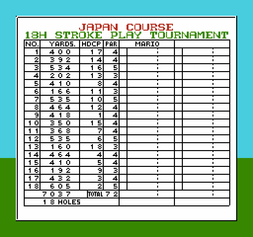

# The Scorecard Screen

> **Note**: This document was written by Claude based on investigation requested by jdharms.

The card you get from the pause menu during a round. Everything on it is drawn by one
routine, **`DrawScorecardScreen`, bank 2 `$AE76`**, far-called from bank 13 `$8523` and
`$976D`. Renders rebuilt straight out of the ROM are in `renders/scorecard/`
(`render_scorecard.py` replays the ROM-driven writes; the score columns stay empty
because those come from RAM).



## The routine

```
DrawScorecardScreen:
$AE76  JSR $CDB3                 ; rendering off - every write below goes straight to $2007
$AE79  JSR $D291                 ; hide all sprites
$AE7C  JSR LoadCompressedGraphics
       .db $02, $69, $B4         ; bank 2 $B469 -> PPU $1000-$17FF, the card font
$AE82  JSR LoadCompressedGraphics
       .db $02, $0B, $B9         ; bank 2 $B90B -> PPU $2000-$23FF, the blank card + attrs
$AE88  LDA GolfGameMode ($0100)
$AE8B  JSR DispatchInlineJumpTableFF ($D267)
       $00->$AFFE $01->$B020 $02->$B04A $04->$B079 $05->$B097 $06->$B0C1 $07->$B0CE
$AEA4  LDA CurrCourse ($0102)
$AEA7  JSR DispatchInlineJumpTableFF
       $00->$AFC2 $01->$AFD8 $02->$AFEB
$AEB4  JSR Load32BytesToBuffer
       .dw $B0EB                 ; scorecard palette -> PaletteBuffer $0476
$AEB9  ...                       ; the 18 yardage / handicap / par rows
$AF2F  ...                       ; total yardage, holes played
$AF64  JSR $CDBE                 ; rendering back on
```

The two `DispatchInlineJumpTableFF` calls are where the title text comes from. The
game-mode handler draws the title, the course handler draws `JAPAN COURSE` /
`US COURSE` / `UK COURSE`. Each handler is three or four instructions plus its string.

## Tile encoding

Two fonts share the card's pattern table, which is why the same digit has two indexes.

| Range | Meaning |
|---|---|
| `$00`-`$09` | `0`-`9`, the large outlined title font |
| `$0A`-`$23` | `A`-`Z`, same font |
| `$24` | space (title font) |
| `$2B` | boxed `A`, the albatross marker |
| `$30`-`$3B` | pre-composed header words: `NO.` `PAR` `YARDS.` `HOLES` |
| `$3C`-`$3F` | narrow `1` (hole numbers 10-18), then `+` `-` `±` |
| `$40`-`$49` | `0`-`9`, the small table font |
| `$4A`-`$54` | card frame and blank cells; **`$51` is the thin column rule, `$52` is blank** |
| `$55`-`$5A` | `TOTAL`, `HDCP` |
| `$5B`-`$62` | `MARIO`, `LUIGI` (three tiles each, then a blank) |
| `$63`-`$6C` | `O -` indicator, `UP`, `DOWN`, `EVEN` |
| `$6D`-`$6F` | birdie / over-par / eagle markers |
| `$73`-`$7F` | `MARK`, `BILLY`, `TONY`, `STEVE` |

`$52` doubles as the leading-zero blank: both digit formatters return it instead of a
zero tile in the high position.

## Title strings

Every title is a `WriteNametableTiles` ($CE84) descriptor: `dest_lo, dest_hi, header,
rows`, then the tiles. `header & $3F` is the width; bit 7 means the two bytes after
`rows` are a pointer to the tile data instead; bit 6 means repeat one byte.

| `GolfGameMode` | Handler | Descriptor | PPU | Text |
|---|---|---|---|---|
| `$00` | `$AFFE` | `$B00D` | `$2089` | `18H STROKE PLAY` |
| `$01` | `$B020` | `$B02C` | `$2083` | `18H STROKE PLAY TOURNAMENT` |
| `$02` | `$B04A` | `$B05B` | `$2083` | `36H STROKE PLAY TOURNAMENT` |
| `$04` | `$B079` | `$B085` | `$2089` | `18H MATCH PLAY` |
| `$05` | `$B097` | `$B0A3` | `$2083` | `18H MATCH PLAY  TOURNAMENT` |
| `$06` | `$B0C1` | — | — | `36H MATCH PLAY  TOURNAMENT` |
| `$07` | `$B0CE` | `$B0DA` | `$2089` | `BET ON 1 HOLE` |

The 26-wide strings start at column 3; the short ones are centred by hand at column 9.
The two tournament match-play strings carry a **double space** before `TOURNAMENT`,
padding them to the same 26 tiles as the stroke-play ones.

Mode `$06` is the odd one out: instead of a tile string it reloads a *second complete
nametable* from `$BA0B`, with the title already baked in. Mode `$03` has no entry at
all.

Course names, same format:

| `CurrCourse` | Handler | Descriptor | PPU | Text |
|---|---|---|---|---|
| `$00` | `$AFC2` | `$AFC8` | `$206A` | `JAPAN COURSE` |
| `$01` | `$AFD8` | `$AFDE` | `$206B` | `US COURSE` |
| `$02` | `$AFEB` | `$AFF1` | `$206B` | `UK COURSE` |

## The yardage / handicap / par column

`$AEB9`-`$AF2D` builds a 9-tile descriptor in `NametableDescriptorBuffer` ($0410) and
writes it 18 times, bottom-up from PPU `$22E6` (row 23, column 6), subtracting `$20`
each pass:

```
col  6  7  8   9  10  11 12  13  14
    d2 d1 d0  $52 $51 h1 h0  $51 par
```

`$0417`/`$0418`/`$041B` (the blank and the two rules) are set once, outside the loop;
only the digits change. The distances come from the three BCD tables `$DD3B`/`$DD71`/
`$DDA7` in the fixed bank, the handicap from `$DDDD`, par from `$DD05`, all indexed by
`CourseHoleOffsetTable[$DBBB][course] + hole`.

Then two fixed cells:

- **Total yardage** at PPU `$2305`. The thousands digit is hardcoded `LDA #$47` (`7`);
  the other three come from three 3-byte tables at `$AF71`/`$AF74`/`$AF77`, giving
  **7037** (Japan), **7102** (US), **7049** (UK).
- **Holes played** at PPU `$2325`, `GameProgress` ($95) through `ByteToTwoDigitTiles`.

`TOTAL 72` on row 24 is not drawn at all - it is part of the blank card in `$B90B`.
All three courses are par 72, so the game gets away with it.

## The score columns

`DrawPerHoleScores` ($B162) loops players (`PlayerCount` $9A down to 0) x holes
(0 to `GameProgress`), writing a 7-tile cell per hole: the score-vs-par marker, the
stroke count, and the putt count.

- strokes: `MaybePerHoleStrokes` `$0134 + player*36 + hole` (stride from `$B1F4`)
- putts: `MaybePerHolePutts` `$017C + player*18 + hole` (stride from `$B1F1`)
- marker: `ScoreVsParMarkerTable` `$B1EC`, indexed by `par - strokes`, clamped to 4
  when over par - blank, birdie, eagle, albatross, bogey-or-worse

`SetScoreCellNametableAddr` ($B1F6) picks the column: `$0F` for player 0's holes 1-18,
`$16` for player 1 **or** for holes 19-36 of a 36-hole round. So a 36-hole card reuses
the opponent column for the back eighteen.

`DrawPlayerTotals` ($B218) writes the two totals cells at PPU `$230F` and `$2316`
from three word pairs indexed by `player*2`: `$04DE` total strokes, `$04E2` total putts,
and `$04E6`, a *signed* word - strokes relative to par - whose sign picks `+`, `-` or `±`
from `$3D`-`$3F` before its three digits.
`Draw36HoleTotals` ($B238) re-adds the per-hole arrays itself when `GameProgress` is
past 18, then falls back into `$B218`.

Match play replaces all of that: `DrawMatchPlayHoleResults` ($B37B) writes a single
`O`/`-` marker per hole, and `DrawMatchPlayStanding` ($B3F7) writes `n UP` / `n DOWN`
(row templates at `$B449` and `$B459`, copied into the buffer by
`CopyInlineMemoryBlock`) or `EVEN` (`$B43B`) when the two hole counts are level.

## Golfer names

`DrawOpponentName` ($B110) writes 4 tiles at PPU `$20B8` (row 5, column 24) from
`GolferNameTileData` `$B14A`, indexed by `OpponentGolferIdentity` ($0131) through the
pointer tables at `$B13E`/`$B144`. `MARIO` above the left column is part of the blank
card, not drawn. `DrawOpponentNameIfPresent` ($B10B) is the same thing gated on
`PlayerCount` being non-zero; the stroke-play-tournament and match-play modes call
`$B110` directly instead.

**Possible data bug, not yet confirmed on hardware.** Every entry in the table is three
name tiles plus a blank:

| Identity | Bytes | Renders |
|---|---|---|
| 0 Mario | `5B 5C 5E 5F` | `MA` `RI` *(blank)* `LU` |
| 1 Luigi | `5F 60 61 52` | `LUIGI` |
| 2 Steve | `7C 7D 7E 7F` | `STEVE` |
| 3 Mark | `73 74 75 52` | `MARK` |
| 4 Tony | `79 7A 7B 52` | `TONY` |
| 5 Billy | `76 77 78 52` | `BILLY` |

Entry 0 skips `$5D` (the `O` of `MARIO`) and picks up `$5F` (the `LU` of `LUIGI`); it
should read `5B 5C 5D 52`. Whether it is ever visible depends on whether identity 0
can reach `$0131` as an opponent - that needs a breakpoint on `$B118` to settle.

## Two dispatchers, not one

`$D267` is a second copy of `DispatchInlineJumpTable`'s front half. It shares the tail
at `$D24F`, so it behaves identically - exact compare against A, inline `(key, lo, hi)`
triples, last match wins, post-table return address stacked before `JMP ($24)` - except
that its table ends on **`$FF`**, so `$00` is a usable key. The scorecard needs that:
`GolfGameMode 0` and `CurrCourse 0` are both real values.

Both are registered in `INLINE_ARG_ROUTINES`, along with `$CE7E`
(`WriteNametableTilesMode2`, 2 inline bytes) and `$D41A` (`CopyInlineMemoryBlock`,
6 inline bytes: src, dst, length).

`$D8A2 ReadInlineWordParameter` and `$D436` are *not* inline-argument routines, despite
the names. Both do `TSX` then read `$0103,X`, which skips their own return address - so
the inline word belongs to whoever called *their* caller. `JSR $D8A2` consumes nothing;
it is the enclosing routine (`Load32BytesToBuffer $D80A`, and a dozen others) that takes
the two bytes.

## Modifying the card

Everything below assumes free space is available somewhere in bank 2.

### Title and course-name strings

Each string is a `WriteNametableTiles` descriptor reached through the inline `.dw` that
follows the handler's `JSR $CE84`. Changing the pointer is a two-byte edit:

| String | Pointer at | Descriptor |
|---|---|---|
| `JAPAN COURSE` | `$AFC5` | `$AFC8` |
| `US COURSE` | `$AFDB` | `$AFDE` |
| `UK COURSE` | `$AFEE` | `$AFF1` |
| `18H STROKE PLAY` | `$B00A` | `$B00D` |
| `18H STROKE PLAY TOURNAMENT` | `$B029` | `$B02C` |
| `36H STROKE PLAY TOURNAMENT` | `$B058` | `$B05B` |
| `18H MATCH PLAY` | `$B082` | `$B085` |
| `18H MATCH PLAY  TOURNAMENT` | `$B0A0` | `$B0A3` |
| `BET ON 1 HOLE` | `$B0D7` | `$B0DA` |

A same-length-or-shorter string is an in-place edit of the descriptor: fix the width byte
(offset +2) and the dest address (+0/+1) to re-centre, then the tiles. A longer one goes
in free space with the `.dw` repointed. Whole handlers can be repointed too, in the
dispatch tables at `$AE8E` (game mode) and `$AEAA` (course).

The title font has **only `A`-`Z`, `0`-`9` and space** (`$00`-`$24`). No lowercase, no
punctuation.

**Colour is set by the attribute table, and the two rows are not equally forgiving.**

- The title row (4) sits in attribute row 1, which is palette 2 (`$19` green) across
  **columns 2-29** - the whole card. Any title placement works.
- The course-name row (3) is the lower half of attribute row 0, palette 3 (`$16` red)
  over **columns 10-21 only**, sized to fit `JAPAN COURSE` exactly. Outside that band
  the text comes out in palette 0, whose colour 2 is `$25` (pink).

To widen the red band, patch the four attribute bytes - they are a plain literal in the
compressed nametable stream at bank 2 **`$B9F2`** (`C0 F0 F0 30`, covering columns 8-23).
Bits 4-7 of each byte are the lower half of the attribute row, i.e. tile row 3. The
mode-6 card at `$BA0B` stores the same region as a `$20` run of six `$F0` bytes seeded at
**`$BB04`**, so there columns 8-31 are already all palette 3.

Changing the scorecard name does not touch the course intro scene, which has its own
copy - see `course_intro_scene.md`.

### Un-hardcoding the total-yardage thousands digit

`$AF2F`-`$AF4E` is 32 bytes that load four digits one at a time, with the first one
hardcoded (`LDA #$47`). A four-entry loop over a `4 x course` table of *tile* values
(no `ORA #$40` needed) fits in 20 bytes, leaving the remaining 12 for the table itself -
so a three-course version needs no free space at all:

```
$AF2F  AD 02 01     LDA CurrCourse
$AF32  0A 0A        ASL A : ASL A          ; course * 4
$AF34  AA           TAX
$AF35  A0 00        LDY #$00
$AF37  BD 43 AF     LDA TotalYardageTiles,X
$AF3A  99 14 04     STA $0414,Y
$AF3D  E8 C8        INX : INY
$AF3F  C0 04        CPY #$04
$AF41  D0 F4        BNE $AF37
$AF43  .db $47,$40,$43,$47   ; 7037  Japan
       .db $47,$41,$40,$42   ; 7102  US
       .db $47,$40,$44,$49   ; 7049  UK
```

`$AF4F` onward (the `JSR WriteNametableTiles` / `.dw $AF6B`) is untouched, and the old
`CourseTotalYardageDigitTables` at `$AF71`-`$AF79` become reclaimable. Move the table
out to free space if you need more than three courses.

Doing it *properly* - summing the three BCD distance tables for the course instead of
tabling the answer - keeps the total honest when holes are edited, but needs a 16-bit
accumulator and a four-digit version of `WordToThreeDigitTiles`.

### `TOTAL 72`

The two digits are a plain literal inside the compressed nametable stream, so this is a
same-length byte edit with no re-encoding:

| Card | ROM (bank 2) | Bytes |
|---|---|---|
| `$B90B` main | `$B9BF` | `47 42` |
| `$BA0B` mode 6 | `$BAD5` | `47 42` |

For a value that follows the course, write the cell from code instead: two tiles at PPU
`$230D`, summing `ParTable[$DD05]` over the course's 18 holes and running the result
through `ByteToTwoDigitTiles`. The natural splice is `$AF64 JSR $CDBE` - replace it with
a `JSR` to the new routine, which draws the cell, calls `$CDBE` itself, and returns.
Everything must happen before `$CDBE` turns rendering back on.

(All three vanilla courses really do total 72, so vanilla is not lying.)

### The name over the player column

`MARIO` at row 5, columns 17-20 is part of the blank card, not drawn. In the compressed
stream it is a `$60` **incrementing run**, length 4, seeded `$5B` at bank 2 **`$B935`** -
`$5B $5C $5D` is `MARIO` and `$5E` is the framed empty cell that follows it.

That makes a one-byte change possible for the two other names that are also four
consecutive tiles ending in a framed cell:

| Seed at `$B935` | Renders |
|---|---|
| `$5B` | `MARIO` (vanilla) |
| `$5F` | `LUIGI` |
| `$7C` | `STEVE` |

`MARK`, `BILLY` and `TONY` are followed by the next name's first tile, so for those the
run has to become a `$00` literal of four bytes - three bytes longer. The stream is
position-independent (lookback offsets are relative to the destination PPU address, not
to ROM), so the fix is to copy the stream to free space, grow it there, and repoint the
table header word at `$B90E`.

The general answer is to not touch the blob at all: add a second `DrawOpponentName`
writing four tiles at PPU `$20B1` (row 5, column 17) out of `GolferNameTileData`. `$B110`
is the template - only the identity source (`$0131`) and the destination (`$20B8`)
differ. Note there is no "which golfer is player 1" variable to point it at: bank 13
`$822C`-`$8237` sets `GolferIdentity` to 0 for player index 0 unconditionally, so player
one is always Mario. A variable name needs a new RAM byte, or a constant.

If player one can ever be Mario there, fix `GolferNameTileData` first: entry 0 is
`5B 5C 5E 5F` and should be `5B 5C 5D 52`.
